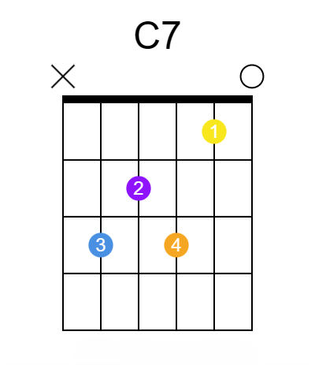

# Acordes (Chords)

**Notas tocadas em conjunto.**

**Geralmente são tríades.**

**Acordes tocados nas três primeiras casas, que possuem cordas tocadas abertas, são chamados acordes abertos (open chords).**

-   Acordes são nomeados conforme sua nota-raíz ou nota fundamental (a menor nota tocada).
-   Sua qualidade (maior ou menor), depende da terça após a raíz.

> [!NOTE]
> Acordes diatônicos são aqueles formados por notas tais quais todas estão dentro de uma clave/tonalidade.

## Acordes menores (Minor chords)

-   Acordes menores são representadas por "m". Se não há "m", então presume-se um acorde maior.

## Acordes diminutos e meio-diminutos (Diminished and half-diminished chords)

-   Se a quinta do acorde é diminuta ou meio-diminuta, então a terceira é menor.
    -   Diminuto é representado por "dim" ou "o". Sobrepõe o "m".
    -   Meio-diminuto é representado por "m7b5" ou "ø"

## Acordes aumentados

-   Se a quinta do acorde é aumentada, então a terceira é maior.
-   Aumentado é representado por "aug" ou "+". Sobrepõe o "m".

## Power chords

**São acordes consistidos de uma nota raíz e sua quinta perfeita.**

-   São representados por "5" na nomenclatura. Ex.: C5
-   Não podem ser maiores, menores, diminutos e nem aumentados.

## Acordes suspensos (Suspended chords)

**São acordes cuja terça é substítuida por uma segunda maior ou quarta perfeita.**

-   Denotados por "sus2" e "sus4", respectivamente.

## Intervalos adicionados

**Acordes podem adicionar uma nota para soarem melhor.**

-   Sexta maior: Representado por "6".
-   Sétima menor: Representado por "7".
-   Sétima maior: Representado por "maj7".
-   Nona maior: Representado por "add9".

### Extensões de acorde (Chord extensions)

**É outra nota adicionada a um acorde de quatro notas. Sempre possuem uma sétima menor, exceto quando explicitado que não.**

-   Ex.: b9, 9, 11, #11, b13, 13.

## Acordes com baixo alternativo (Slash chords)

**São acordes onde a menor nota não é a nota-raíz. São denotados por "/X", onde X é a menor nota. Ex.: C/G**.

## Tríades (Triads)

**Acorde feito de três notas: Raíz-Terça-Quinta (Intervalos com base na raíz)**

-   Power chords e sétimas não são tríades.

**Tenta-se encontrar a nota raíz na menor corda possível, não palhetando cordas menores que esta.**

-   Tríade maior: Tom alegre e claro. R-M3-P5
-   Tríade menor: Tom triste e sombrio. R-m3-P5
-   Tríade diminuta: Tom tenso. R-m3-dim5
-   Tríade aumentada: Tom misterioso R-M3-aug5

### Aberturas (Voicings)

**Ao tocar acordes, é comum tocar mais do que três cordas ao formar uma tríade. Mesmo assim, ainda é uma triade, pois nessas outras cordas tocam-se as mesmas notas, apenas acentuando seu som. Isso é chamado abertura.**

### Inversões (Inversions)

**Consiste em alterar a ordem da tríade. A posição original é chamada "posição raíz"**

-   1ª Inversão: 3-5-R
-   2ª Inversão: 5-R-3

# Exemplos

## Acordes Maiores

### CAGED

---

## Acordes Menores

**Basta descer um semitom na nota mais aguda de sua contraparte maior.**

## Acordes Dominantes/com Sétima

