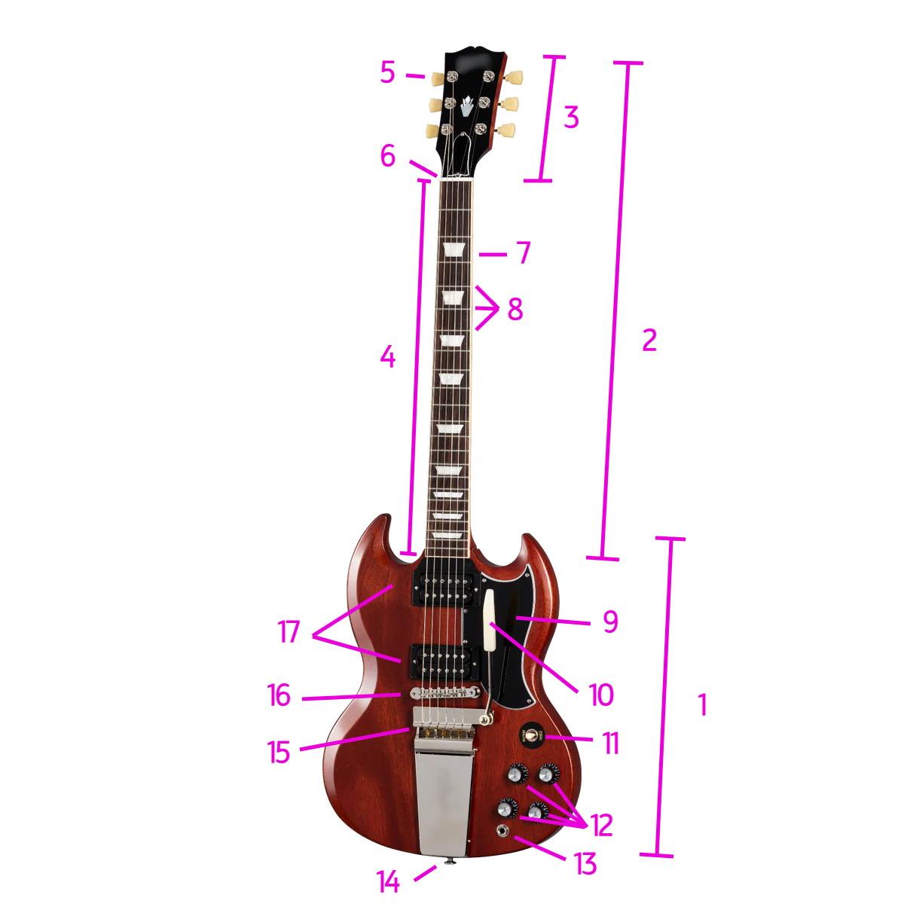

# Anatomia da Guitarra

	

## 1 - Corpo (Body)

### 9 - Escudo (Pickguard/Scratchplate)

-   Evita os arranhões da palheta no corpo da guitarra.

### 10 - Alavanca (Tremolo/Whammy Bar)

-   Altera a afinação das cordas, apertando ou afrouxando-as.

### 11 - Chave Seletora de Captador (Pickup Selector Switch)

-   Define quais captadores vão ser usados para captar o som.

### 12 - Potenciômetros (Knobs)

-   Ajustam o volume e tom dos captadores.

### 13 - Jack

-   Onde se conecta o cabo de alimentação.

### 14 - Pino da Correia (Strap Button)

-   Onde se encaixa a correia para a sustentação da guitarra.

### 15 - Cavalete (Tailpiece)

-   Ancora uma extremidade das cordas.

### 16 - Ponte (Bridge)

-   Sustenta as cordas e transmite suas vibrações para os componentes da guitara.
-   Podem ser do tipo "vibrato" e "hardtail". A primeira consiste em uma ponte móvel para a utilização de uma alavanca, já a segunda é fixa e possui mais estabilidade de afinação.

### 17 - Captadores (Pickups)

-   Captam as vibrações das cordas.
-   Geralmente vão de 1 a 3. O mais próximo do braço é chamado "captador do braço", o mais próximo da ponte é chamado "captador da ponte" e o do meio é chamado "captador do meio", trivialmente.
-   São divididos em "single-coils" e "humbuckers". Os primeiros são mais brilhantes e claros, usados comumente no blues e no indie. Os segundos consistem em dois single-coils unidos em polaridade reversa, e possuem um som mais encorpado, grosso, que combina bastante com distorção, sendo usados comumente no rock, no metal, e até no jazz.

## 2 - Braço (Neck)

### 3 - Cabeça/Mão (Headstock)

#### 5 - Tarraxa (Tuning Peg/Tuning Key/Tuner/Machine Head)

-   Ajusta a afinação de uma corda da guitarra.

#### 6 - Pestana/Capotraste (Nut)

-   Separa o headstock do braço/escala da guitarra.

### 4 - Escala/Braço (Fretboard/Fingerboard)

#### 7 - Casa (Fret)

-   A partir da pestana, casa casa consiste em um semitom acima da afinação de cada corda.
-   São demarcadas pelos trastes.
-   Geralmente possuem indicadores pintados para facilitar o reconhecimento das posições. A 12ª casa geralmente possui dois indicadores ou um indicador diferente dos demais, justamente por ser uma oitava acima da afinação das cordas.

#### 8 - Traste (Fret)

-   Demarcam as casas.
