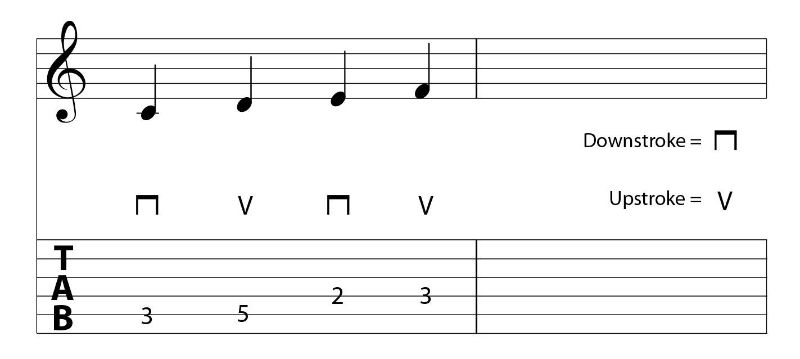
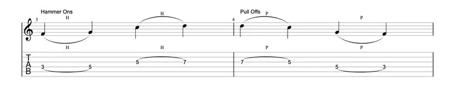
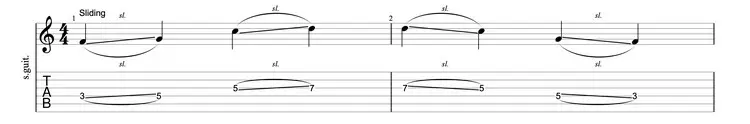
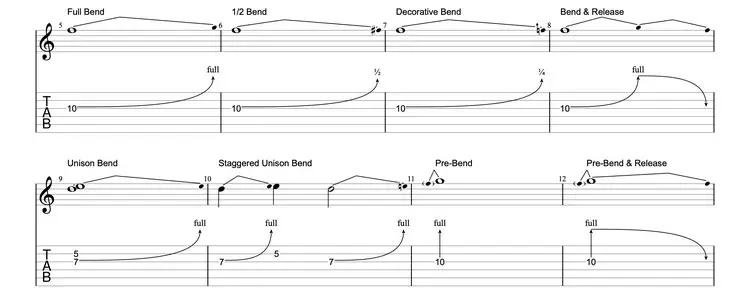
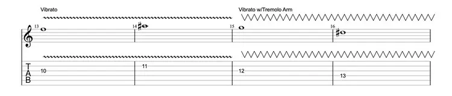
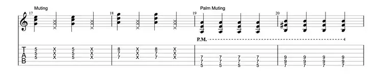

# Teoria

## Nota (Note)

**As notas na guitarra seguem a afinação de cada corda em cada casa, sendo a corda aberta a nota da afinação. Cada casa representa um semitom. Considerando a afinação padrão, a partir da primeira casa na corda E maior, temos F-F#-G-G#-A-A#-B-C-C#-D-D#-E**

**A partir da 12ª casa as notas se repetem, uma oitava abaixo.**

**Subir a corda na mesma casa corresponde a 5 semitons, exceto de G para B, que são 4 semitons**

## Clave/Tonalidade (Key)

**Coleção de notas que determina o clima e sentimento da música.**

-   Tônica (Tonic): Nota central de uma tonalidade. Ex.: na clave de C, a tônica é C.
-   Tonalidades relativas: Aquelas que compartilham as mesmas notas e armadura de clave. Ex.: C e Am

## Arpejo (Arpeggio)

-   Consiste em tocar as notas de um acorde separadamente ao invés de todas de uma vez.

## Técnicas

### Palhetada (Picking)

#### Palhetada Alternada (Alternate Picking)

-   Consiste em tocar cada nota palhetando as cordas alternadamente para cima e para baixo.

#### Sweep Picking

-   Consiste em palhetar várias notas em um só movimento, mas diferente da forma que se faz em acordes, cada nota é palhetada uma a uma ao invés de uma vez.

#### Economy Picking

-   Consiste em palhetar em direção à próxima nota. Por exemplo, na palhetada alternada, ao tocar as três últimas cordas, toca-se E↓A↑D↓, enquanto em economy picking toca-se E↓A↓D↑. Ao tocar a mesma corda, usa-se a palhetada alternada.

### Legato

-   "Ligado" em italiano. Trata-se de tocar as notas conectadas, sem intervalos de tempo.
-   Consiste em aguardar o máximo possível para soltar a corda até a próxima nota, ou tocar a próxima enquanto a atual continua a soar.
-   Demarcado por um arco (slur) na pauta.

#### Hammer-on

-   Consiste em palhetar uma nota e então, sem palhetar novamente, tocar alguma nota mais alta na mesma corda. Ou seja, tocar uma nota e então colocar o dedo em uma nota mais alta enquanto a outra está soando.

> [!TIP]
> O hammer-on na corda aberta é feito antes da pestana da guitarra, na parte da corda que está no headstock.

#### Pull-off

-   Oposto ao hammer-on, consiste em retirar o dedo de uma nota que está soando, enquanto há outro dedo em uma nota mais baixa (ou a corda aberta).

#### Tapping

-   São hammer-ons ou pull-offs realizados com a mão da palheta.
-   Geralmente é utilizado para alcançar intervalos muito grandes para a mão do braço.
-   Geralmente são denotados em tablaturas por um arco de legato com um "T" acima.

#### Slide ou Glissando

-   Consiste em palhetar uma nota e então deslizar o dedo para outra casa enquanto ela soa.

### Bending

-   Consiste tocar uma nota e arquear a corda para cima ou para baixo, fazendo-a alcançar outro semitom.

#### Pre-bending

-   Como um bend, mas em arqueia-se a corda antes de tocar a nota.

#### Release

-   Trata-se de retornar a corda ao seu lugar original após o bend.

### Vibrato

-   Semelhante ao bending, mas feito sucessivamente para cima e para baixo (fazendo a nota vibrar) e de forma suave, sem fazer a nota sair do tom. Também pode ser feito na horizontal.

### Muting

#### Palm Muting

-   Consiste em deixar a lateral da mão (não a palma, diferente do nome da técnica) de palhetar em cima das cordas de forma suave, o mais próximo possível à ponte, e então tocar as notas.
-   Gera um som "mastigado" ou "triturado".

### Harmônicos

-   São sobretons (tons com frequência de onde maior que a fundamental) amplificados.

#### Naturais

-   São encontrados em lugares específicos da escala, mais comumente em cima dos trastes. Ex.: Os trastes entre 5/6, 7/8, 12/13.
-   O harmônico é alcançado tocando levemente a corda com o dedo, sem pressionar, e então palhetando.
-   Geralmente são indicados por "N.H.", "H.N." ou "Harm." acima da tablatura. Ou também por pelo número da casa envolto em "<>" ou um losango, que também pode estar ao lado.

#### Artificiais ou Pinch Harmonics

-   São harmônicos alcançados em alguma nota (de forma não-natural).
-   Diferentemente dos naturais, a corda deve ser pressionada.
-   A técnica depende inteiramente da mão de palhetar. Consiste em palhetar a nota com a palheta um pouco mais curvada e quase que imediatamente tocar a corda com a lateral do polegar da palheta. O toque do dedo cancela a frequência fundamental da corda, permitindo que um dos sobretons domine, produzindo um som mais "guinchado".
-   A posição da mão da palheta em relação à ponte e o braço afeta muito no som.
-   Geralmente são indicados por "P.H." acima da tablatura.

#### Tap Harmonics

-   São harmônicos alcançados ao usar tapping na casa uma oitava acima da nota que se está tocando.
-   O tapping deve ser feito em cima do traste.

#### Touch Harmonics

-   Similares ao tap harmonics, porém toca-se (ao invés de pressionar) suavemente na corda uma oitava acima da nota que se está tocando, e então palheta-se suavemente a corda.

### Double-stop ou Díade

-   Consiste em tocar duas notas ao mesmo tempo. Geralmente um terça, quarta, quinta, sexta ou oitava.
