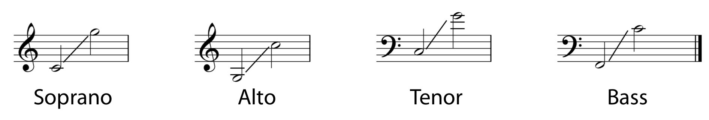

# Melodia

**A _melodia_ (Melody) é uma sucessão coerente de notas.**

-   É inerentemente relacionada às [escalas](escalas).

## Voz

**Na música, uma _voz_ (Voice) corresponde a uma linha melódica na pauta, ou seja, uma melodia.**

-   Os tipos mais comuns são denominados pelo acrônimo _SATB_. Da voz mais alta para a mais baixa: _Soprano_, _Alto_, _Tenor_ e _Baixo_ (Bass).
    -   Sopranos e altos ficam na clave de sol.
    -   Tenores e baixos ficam na clave de fá.
    -   Sopranos e tenores têm a haste da nota apontando para cima.
    -   Altos e baixos têm a haste da nota apontando para baixo.
    -   Em tríades geralmente a nota dobrada é o baixo.

> [!IMPORTANT]
> Os alcances médios de cada voz no SATB:
> 

## Resolução

**A _resolução_ (Resolution) corresponde ao processo da melodia progredir a um estado de descanso ou estabilidade.**

-   Quando alguma nota cria uma expectativa, gerando uma certa previsibilidade sobre a próxima nota, ela tem uma _tendência_ (Tendency) a se resolver.
-   Na escala diatônica os graus 1, 3 e 5 são considerados mais estáveis, enquanto que os graus 2, 4 e 6 e 7 são mais instáveis, tendo uma tendência a se resolver nos estáveis mais próximos.

> [!IMPORTANT]
> Uma nota ter tendência a se resolver em outra não quer dizer que ela DEVE se resolver nela.
