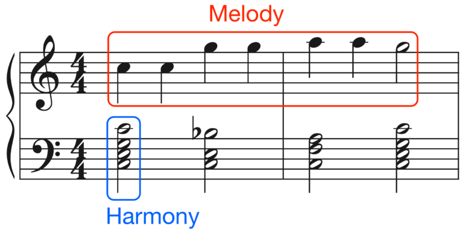
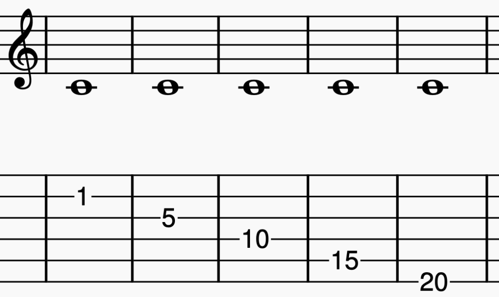

# Teoria musical básica

> [!IMPORTANT]
> Os conceitos musicais são fortemente entrelaçados, dependendo um do outro para total compreensão. Portanto pode ser necessário fugir da ordem apresentada para o entendimento de tais.
> Todos os conceitos utilizados aqui se referem somente à música ocidental moderna.
> O conceito _obra musical_ (Piece) se refere a qualquer arranjo de som utilizando vocais e/ou instrumentos, enquanto uma _canção_ (Song) é uma obra musical que necessariamente possui vocais. Aqui, ambos os termos serão generalizados para _música_, exceto quando explicitado.

> [!NOTE]
> A _partitura_ (Sheet/Score) é a representação visual da música, geralmente composta pela pauta, notas e outros elementos.

**_Música_ (Music) é o arranjo dos sons de maneira a formar conteúdo expressivo. É dividida fundamentalmente em [_ritmo_](ritmo) (Rhythm), [_melodia_](melodia) (Melody) e [_harmonia_](harmonia) (Harmony). A interação entre as três é chamada _textura_ (Texture).**

> [!TIP]
> A melodia é o que carrega a música, o seu desenrolar (o que se assovia). A harmonia é o suporte de fundo, os sons que acompanham e enriquecem a melodia, criando profundidade e contexto.

-   A música também pode ser dividida em:
    -   _Timbre_ (Timbre): características "concretas" do som. Depende do material do instrumento e a forma pela qual se interage com ele.
    -   _Dinâmica_ (Dynamics): diz respeito à intensidade ou força com que um conjunto de notas deve ser executado.
    -   _Forma_ (Form): é o padrão no qual os agrupamentos musicais são organizados e como eles se repetem.

## Frequência

**A _frequência_ (Frequency) é um conceito físico que diz respeito à quantas vezes uma onda sonora vibra no período de um segundo. É dada em Hertz (Hz).**

## Altura

**Sons vibram em frequências que soam diferentes ao ouvido. Algumas frequências específicas são utilizadas na música como unidades básicas de construção. Cada uma dessas frequências é chamada _altura_ (Pitch).**

-   Quanto maior a frequência, mais agudo o som é percebido.
-   Para qualquer altura, se dobrarmos ou dividirmos pela metade a sua frequência, o som será percebido como sendo o mesmo, porém mais agudo ou mais grave, respectivamente. A cada vez que dobramos a frequência, subimos uma _oitava_ (Octave) na altura, e a cada vez que diminuímos, descemos uma oitava.
    -   Também podemos analisar a oitava como o intervalo de alturas até que uma se "repita".

> [!TIP]
> A frequência padrão de afinação é de 440Hz. É chamada `Altura de Stuttgart` (Stuttgart pitch).

### Classe de Altura

-   Como as frequências são infinitas, uma determinada altura possui infinitas oitavas. Então, para nos referirmos a todos os sons que são múltiplos de uma altura, dizemos que estes compõem uma _classe de altura_ (Pitch class).

## O Alfabeto Musical

-   Na música, utilizamos como base 12 classes de altura, que são comumente (apesar de não serem necessariamente a mesma coisa) chamadas de _notas_ (Notes). Para diferenciarmos essas classes, relacionamos cada uma a uma letra do alfabeto romano.
-   Das 12 classes utilizadas, 7 são frequências básicas com maior distinção sonora ao ouvido. Essas são nomeadas conforme as 7 primeiras letras: A, B, C, D, E, F e G.
    -   Por ser mais familiar e edificante, a ordem mais reconhecida das classes é C, D, E, F, G, A e B. Essa ordem é denominada escala de C maior.
    -   Naturalmente, após a última altura de uma classe em uma oitava, repetimos a primeira em uma oitava acima. É justamente pelo intervalo de 8 alturas (naturais) que as oitavas são chamadas assim.
-   Existe uma forma mnemônica de se referir às classes ou notas, utilizando sílabas para seu reconhecimento e memorização. Esta técnica é denominada _solfejo_ (Solfège).

<table>
	<tr>
		<th>Classe/Nota</th>
		<td>A</td>
		<td>B</td>
		<td>C</td>
		<td>D</td>
		<td>E</td>
		<td>F</td>
		<td>G</td>
	</tr>
	<tr>
		<th>Solfejo</th>
		<td>Lá</td>
		<td>Si</td>
		<td>Dó</td>
		<td>Ré</td>
		<td>Mi</td>
		<td>Fá</td>
		<td>Sol</td>
	</tr>
	<tr>
		<th>Solfejo menor</th>
		<td>Le</td>
		<td>Se</td>
		<td>Dó</td>
		<td>Ré</td>
		<td>Me</td>
		<td>Fá</td>
		<td>Sol</td>
	</tr>
</table>

> [!NOTE]
> O nome das notas em português derivam de um hino a São João cantado em um tom acima (ou seja, iniciando em C), descrito abaixo:

> **Ut** queant laxis,
>
> **Re**sonare fibris,
>
> **Mi**ra gestorum,
>
> **Fa**muli tuorum,
>
> **Sol**ve polluti,
>
> **La**bii reatum.
>
> **Sanc**te Ioannes
>
> > "Para que os servos possam, com suas vozes livres, ressoar os teus atos maravilhosos, limpe as impurezas dos lábios cheios de culpa, ó São João."
>
> > `Ut` foi substituído por `Dó` e `Sanc` foi abreviado para `Si` (abreviação de "Sancte Ioannes")

> [!NOTE]
> O nome _solfejo_ deriva de duas das notas utilizadas: `Sol` e `Fá`.
> Em países anglófonos, a nota `Si` é chamada `Ti`, de forma com que cada sílaba comece com uma letra diferente.

**As 7 notas básicas apresentadas são denominadas _naturais_ (Natural).**

-   O símbolo das notas naturais é o _bequadro_: `♮`.

**As outras 5 notas estão entre cada par de notas naturais adjacentes, com exceção de B/C e E/F. Estas são chamadas _acidentais_ (Accidental).**

-   As notas acidentais também também são associadas às mesmas 7 letras do alfabeto, porém utilizam símbolos para a diferenciação das naturais.
-   As notas acidentais são divididas em:
    -   Sustenida (Sharp): Consiste em subir uma altura (um semitom), ou seja, avançar para a próxima nota. O símbolo das notas sustenidas é: `♯`.
        -   Dobrada sustenida/Sustenida dupla (Double sharp): Consiste em subir duas alturas (um tom), ou seja, avançar duas notas. O símbolo das notas sustenidas duplas é `𝄪` ou `♯♯`.
    -   Bemol (Flat): Consiste em descer uma altura (um semitom), ou seja, retroceder para a nota anterior. O símbolo das notas bemóis é: `♭`.
        -   Dobrada bemol/Bemol dupla (Double flat): Consiste em descer duas alturas (um tom), ou seja, retroceder duas notas. O símbolo das notas sustenidas duplas é `♭♭`.
-   A nota entre X e Y pode ser chamada tanto de X♯, quanto Y♭. Isso é chamado de _equivalência enarmônica_ (Enharmonic equivalence/enharmonic spelling).
-   Os símbolos em si, incluindo o bequadro, são chamados _acidentes_ (Accidentals).

> [!IMPORTANT]
> Veja que não há notas acidentais entre B/C e entre E/F, portanto esses dois intervalos são de apenas uma altura, diferente do que acontece com todos os outros intervalos entre as notas naturais, que são de duas alturas.
> Veja também que, apesar de ser um intervalo de 8 notas naturais e daí ter derivado seu nome, uma oitava compreende 12 notas, considerando as acidentais.

> [!TIP]
> Note que _natural_, _acidental_ e _equivalência enarmônica_ são termos que apenas determinam a função de uma altura na música. `D` e `C♯♯` são, respectivamente, uma nota natural e uma nota acidental, porém se referem à mesma altura dentro de uma oitava.

### Notas específicas

-   A a frequência padrão de afinação de 440Hz é uma nota `A` denominada `A440`.
-   A nota `C` encontrada nas teclas no meio do piano é dita `C Central` (Middle C).
    -   O C Central é o C anterior ao A440, ou seja, está 9 notas antes dele (ou 5 teclas brancas no piano).
    -   Tem frequência aproximada de 261.626Hz.
-   Na guitarra, o C central pode ser encontrado nas 5 cordas mais grossas, considerando a afinação padrão:

### Notação científica

-   A notação científica de alturas é uma forma de identificar tanto a classe quanto a oitava de uma altura específica.
-   Consiste em utilizar uma letra para a classe (conforme o padrão já utilizado), e um número para referenciar a oitava.
-   A escala científica parte da frequência 16.3516Hz (nomeada C0), se estendendo indefinidamente.
-   Em notação científica, a A440 é chamada `A4`, e o C Central é chamado `C4`.

> [!TIP]
> [Veja [Clave](#clave) antes] Geralmente as oitavas de 0 a 3 são representadas na clave de Fá e as alturas acima de 3 na clave de Sol.

## Pauta

**A _pauta_ ou _pentagrama_ (Staff/Stave) é uma série de cinco linhas com quatro espaços entre elas, onde a posição da [_cabeça da nota_](#valor-ou-duração) em determinada linha ou espaço indica a altura de uma nota.**

-   Alturas mais graves ficam nas posições inferiores enquanto alturas mais agudas ficam nas posições superiores.

-   As posições da pauta consideram somente as notas naturais. Notas acidentais ficam na mesma posição das naturais, porém são denotadas com o acidente antes da figura da nota.

-   Notas podem estar em faixas acima ou abaixo da pauta, e portanto podem ser colocadas em _linhas suplementares_ (Ledger lines).

-   O fim de uma música é indicado com uma _barra final_ (End bar line), duas barras paralelas onde a direita é mais grossa:

## Clave

**A _Clave_ (Clef) define como as notas serão organizadas na pauta.**

-   Clave de Sol (Treble Clef) é chamada assim porque seu desenho gira em torno da linha onde G se encontra na pauta.
    -   O C Central se encontra na primeira linha suplementar inferior.
-   Clave de Fá (Bass Clef) é chamada assim porque F se encontra na linha entre seus dois pontos na pauta.
    -   O C Central se encontra na primeira linha suplementar superior.
-   Clave de Dó (Alto/Tenor/Mezzo-soprano/Soprano Clef) é chamada assim porque C se encontra na linha entre seus dois pontos na pauta.
-   Grande pauta/Clave dupla (Grand staff/Great stave) é a união das claves de sol (acima) e fá (abaixo). Geralmente usada nas representações de piano. Note que C fica na linha suplementar entre as claves.

> [!NOTE]
> Um "8" acima ou abaixo da clave indica que a pauta deve ser executada uma oitava acima ou abaixo, respectivamente. Um "15" nas mesmas posições indica duas oitavas.

### Armadura de Clave

**A armadura de clave (Key signature) define quais notas devem ser sempre lidas como acidentes na pauta da clave, colocando o acidente na linha ou espaço referente à nota. É colocada após a clave e antes da indicação de compasso.**

	
	

-   Ex.: Ao tocar a escala de G, que possui F#, podemos indicar pela armadura que toda nota F deve ser tocada como F♯, ao invés de marcar cada F como F♯.
-   Na armadura, os bemóis devem vir horizontalmente na ordem `B-E-A-D-G-C-F`, enquanto os sustenidos devem vir na ordem inversa `F-C-G-D-A-E-B`. [Veja mais em [Círculo de Quintas](escalas.md/#círculo-de-quintas)]
-   A armadura define a leitura de toda as instâncias de determinada classe de altura, independente da oitava. Por exemplo, considerando a clave de Sol, se marcarmos na armadura um acidente no F na primeira linha superior, o F no primeiro espaço inferior da pauta também deve ser lido como uma nota acidental.
-   Ao mudar a armadura durante a música, deve-se usar acidentes para "cancelar" acidentes anteriores.
-   Uma armadura nunca vai ter bemois e sustenidos simultaneamente.
-   Pela armadura de clave, é possível [calcular quantos acidentais outras escalas possuem a partir de uma escala base](https://www.musictheory.net/lessons/25).

> [!TIP]
> A armadura de clave quase sempre indica a tonalidade da música.

## Nota

**Uma _nota_ (Note) ou _tom_ (Tone) é um som isolável, encontrado em determinada altura.**

> [!TIP]
> Pode-se pensar na altura como a localização imaginária da nota (seu conceito abstrato) e na nota como a execução da altura (seu conceito "concreto").

-   A nota é a execução do som de uma altura por determinada duração.

### Valor ou Duração

-   Uma nota (sua duração mais específicamente) é representada por uma figura de duração:

-   1: Colchete (Flag). 2: Haste (Stem). 3: Cabeça de nota (Notehead).
    -   As cabeças podem ser abertas (sem preenchimento) ou fechadas (preenchidas).
-   Na pauta, partindo da linha intermediária para cima, a haste das figuras de duração em relação à cabeça aponta para baixo.
-   As figuras de duração possuem relação direta com o [rítmo](ritmo.md), portanto é interessante conhecer os conceitos básicos, como a batida/tempo e o compasso antes.
-   Notas podem durar uma batida inteira, várias batidas ou até mesmo serem menores que uma batida.

**As figuras de duração e suas durações, onde a unidade de tempo referencial é um compasso:**

<table>
	<tr>
		<th>Nota</th>
		<td>Semibreve</td>
		<td>Mínima</td>
		<td>Semínima</td>
		<td>Colcheia</td>
		<td>Semicolcheia</td>
		<td>Fusa</td>
		<td>Semifusa</td>
	</tr>
	<tr>
		<th>Nota em inglês</th>
		<td>Whole/Semibreve</td>
		<td>Half/Minim</td>
		<td>Quarter/Crotchet</td>
		<td>Eighth/Quaver</td>
		<td>Sixteenth/Semiquaver</td>
		<td>Thirty-second/Demisemiquaver</td>
		<td>Sixty-fourth/Hemidemisemiquaver</td>
	</tr>
</table>

-   Cada uma tem exatamente metade da duração da anterior. A semibreve dura todo o compasso.
-   Também existe a Breve (Double whole/Breve):

#### Travessões

-   A partir da colcheia, notas podem ser unidas através de um _travessão_ (Beam) para clarificar a métrica. Ainda assim, são tocadas da mesma forma:

-   Em notas com travessão, a orientação vertical da figura segue a orientação da nota mais distante da linha intermediária.

#### Notas pontuadas

-   As _notas pontuadas_ (Dotted notes) são denotadas por um ponto (Augmentation dot) e aumentam sua duração em metade da duração atual.

-   Cada ponto equivale a aumentar a duração em metade da nota anterior. Ou seja, dois pontos em uma mínima seria `mínima + semínima + colcheia`.

#### Notas ligadas

-   As _notas ligadas_ (Tied notes) são duas notas ligadas por uma ligadura/arco (Tenuto tie), onde a primeira é a nota tocada e a segunda é a duração em que a primeira é aumentada.

-   Geralmente são utilizadas pra manter uma nota soando entre um compasso e outro.
-   A ligadura (tie) não deve ser confundida com a ligadura de expressão (slur). A primeira é sempre executada na mesma altura.

> [!TIP]
> Veja que as notas relacionadas por ligaduras quase sempre terão durações diferentes, pois se tivessem a mesma duração a ligadura poderia ser escrita como uma única nota de maior duração. A exceção mais comum é a extensão da nota para outro compasso.

## Pausas

**Equivalentes silenciosas às notas. Uma _pausa_ (Pause) define uma duração onde não se deve emitir sons.**

-   Pausas também podem ser pontuadas.
-   Não podem ser ligadas.

## Intervalos

**Um _intervalo_ (Interval) é a distância percebida entre duas alturas/notas.**

-   Intervalos funcionam de maneira circular: Com as 12 notas, existem 13 intervalos básicos entre notas adjacentes.
-   Os intervalos são medidos em:
    -   Semitom (Semitone/Half step): intervalo entre duas notas adjacentes. Ex.: `A` e `A♯`, `A♯` e `B`, `B` e `C`, etc.
        -   É classificado como uma segunda menor.
        -   É o menor intervalo possível.
    -   Tom (Tone/Whole step): intervalo que consiste de dois semitons. Ex.: `A` e `B`, `B` e `C♯`, `C♯` e `D♯`.
        -   É classificado como uma segunda maior.
    -   Oitava (Octave): intervalo que consiste de doze semitons ou oito notas naturais.

> [!NOTE]
> Em inglês, `step` também pode significar o intervalo entre uma linha e um espaço adjacentes na pauta. Neste conceito, o `step` não é necessariamente a mesma coisa de um semitom.

### Classificação

#### Tamanho

-   Corresponde à quantidade de notas entre duas notas. Ex.: A e C = 3 (ou terça). A → B → C.
-   Acidentes não são considerados: Tamanho(A-C) = Tamanho(A-C♯).
    -   Portanto também note que, apesar da equivalência enarmônica, Tamanho(A-C♯) != Tamanho(A-D♭). O primeiro é uma terça e o segundo uma quarta.
-   O tamanho entre uma nota e ela mesma é determinado _uníssono_ (Unison), mas não consiste de um intervalo de fato.

<table>
	<tr>
		<th>Tamanho</th>
		<td>2</td>
		<td>3</td>
		<td>4</td>
		<td>5</td>
		<td>6</td>
		<td>7</td>
		<td>8</td>
	</tr>
	<tr>
		<th>Classificação</th>
		<td>Segunda</td>
		<td>Terça</td>
		<td>Quarta</td>
		<td>Quinta</td>
		<td>Sexta</td>
		<td>Sétima</td>
		<td>Oitava</td>
	</tr>
	<tr>
		<th>Classificação em inglês</th>
		<td>Second</td>
		<td>Third</td>
		<td>Fourth</td>
		<td>Fifth</td>
		<td>Sixth</td>
		<td>Seventh</td>
		<td>Octave</td>
	</tr>
</table>

-   Intervalos maiores seguem a ordem.

#### Qualidade

-   Determina se um intervalo de determinada quantidade é dividido pelo número de semitons entre as notas.
-   Acidentes devem ser considerados.
-   _Perfeito_ (Perfect): É estável e único, não se divide. Ex.: Uníssono, quartas, quintas e oitavas. Representado por `P`
-   _Imperfeito_ (Imperfect): Se divide em duas qualidades com características distintas. Ex.: Segundas, terças, sextas e sétimas.
    -   _Maior_ (Major): Um semitom maior que o correspondente menor. Representado por `M`
    -   _Menor_ (Minor): Um semitom menor que o correspondente maior. Representado por `m`.
-   _Aumentado_ (Augmented): Um semitom maior que um intervalo perfeito ou maior. Representado por `A`.
-   _Diminuto_ (Diminished): Um semitom menor que um intervalo perfeito ou menor. Representado por `d`.

<table>
	<tr>
		<th>Semitons</th>
		<td>0</td>
		<td>1</td>
		<td>2</td>
		<td>3</td>
		<td>4</td>
		<td>5</td>
		<td>6</td>
		<td>7</td>
		<td>8</td>
		<td>9</td>
		<td>10</td>
		<td>11</td>
		<td>12</td>
	</tr>
	<tr>
		<th>Qualidade</th>
		<td>PU/P1</td>
		<td>m2</td>
		<td>M2</td>
		<td>m3</td>
		<td>M3</td>
		<td>P4</td>
		<td>TT/A4/d5</td>
		<td>P5</td>
		<td>m6</td>
		<td>M6</td>
		<td>m7</td>
		<td>M7</td>
		<td>P8</td>
	</tr>
</table>

> [!NOTE]
> O `TT` corresponde ao _trítono_ (Tritone), que é a quarta aumentada ou quinta diminuta. Também é conhecido como _diabolus in musica_ por seu tom tenso, sombrio e dissonante.
> É chamado trítono exatamente por ser o intervalo de 6 semitons, que são 3 tons.

> [!NOTE]
> Veja que considerando o tamanho e qualidade, intervalos também podem ser equivalentes enarmônicos, como uma terça maior e uma quarta diminuta, ou um uníssono aumentado e uma segunda menor.

> [!TIP]
> Intervalos maiores soam mais alegres e intervalos menores soam mais sombrios. Intervalos perfeitos soam corajosos, imponentes e sérios.

### Extensão

-   _Simples_ (Simple): menor que uma oitava.
-   _Composto_ (Compound): maior que uma oitava. Ex.: Uma décima também pode ser chamada terça composta.

### Sonoridade

-   _Harmônico_ (Harmonic) ou _vertical_: duas notas são tocadas simultaneamente.
-   _Melódico_ (Melodic) ou _horizontal_: duas notas são tocadas separadamente.

### Tensão

-   _Consoante_ (Consonant): intervalo em que os sons são estáveis e harmonioso, ou seja, combinam, parecem ser o mesmo. Ex.: oitavas.
    -   Os intervalos perfeitos costumam soar mais consoantes.
    -   Na harmonia costumam ser considerados consoantes os uníssonos, terças, quintas, sextas e oitavas.
-   _Dissonante_ (Dissonant): intervalo em que os sons são distintos e não parecem combinar. Ex.: semitons.
    -   Os intervalos imperfeitos costumam soar mais dissonantes.
    -   Na harmonia costumam ser consideradas dissonantes as segundas, quartas, sétimas e o trítono.

### Inversões

**Uma _inversão de intervalo_ (Interval inversion) consiste em aumentar a menor das duas notas em uma oitava.**

-   As tabelas a seguir demonstram os resultados das inversões. Note que a inversão pode ser de qualquer um dos lados.

<table>
	<thead>
		<th colspan="4">Qualidade</th>
	</thead>
	<tr>
		<td>Perfeito</td>
		<th colspan="2">↔</th>
		<td>Perfeito</td>
	</tr>
	<tr>
		<td>Maior</td>
		<th colspan="2">↔</th>
		<td>Menor</td>
	</tr>
	<tr>
		<td>Aumentado</td>
		<th colspan="2">↔</th>
		<td>Diminuto</td>
	</tr>
</table>

<table>
	<thead>
		<th colspan="4">Tamanho</th>
	</thead>
	<tr>
		<td>Uníssono</td>
		<th colspan="2">↔</th>
		<td>Oitava</td>
	</tr>
	<tr>
		<td>Segunda</td>
		<th colspan="2">↔</th>
		<td>Sétima</td>
	</tr>
	<tr>
		<td>Terça</td>
		<th colspan="2">↔</th>
		<td>Sexta</td>
	</tr>
	<tr>
		<td>Quarta</td>
		<th colspan="2">↔</th>
		<td>Quinta</td>
	</tr>
	<tr>
		<td>Trítono</td>
		<th colspan="2">↔</th>
		<td>Trítono</td>
	</tr>
</table>

### Exemplos de cada intervalo simples (e um composto)

<table>
	<thead>
		<tr>
			<th>Intervalo</th>
			<th>1ª Música</th>
			<th>2ª Música</th>
			<th>3ª Música</th>
		</tr>
	</thead>
	<tr>
		<th>2ª Menor</th>
		<td>Tubarão (Tema)</td>
		<td></td>
		<td></td>
	</tr>
	<tr>
		<th>2ª Maior</th>
		<td>Never Gonna Give You Up</td>
		<td>Seven Nation</td>
		<td>Música dos Dedos</td>
	</tr>
	<tr>
		<th>3ª Menor</th>
		<td>Smoke on the Water</td>
		<td>Axel F</td>
		<td>Fallout (Tema)</td>
	</tr>
	<tr>
		<th>3ª Maior</th>
		<td>Sweet Child o' Mine (Baixo)</td>
		<td>Saria's Song</td>
		<td></td>
	</tr>
	<tr>
		<th>4ª Perfeita</th>
		<td>Hino Nacional</td>
		<td>Harry Potter (Tema)</td>
		<td></td>
	</tr>
	<tr>
		<th>Trítono</th>
		<td>Juicebox</td>
		<td>Purple Haze</td>
		<td>Abertura dOs Simpsons (Parte falada)</td>
	</tr>
	<tr>
		<th>5ª Perfeita</th>
		<td>Star Wars (Tema)</td>
		<td></td>
		<td></td>
	</tr>
	<tr>
		<th>6ª Menor</th>
		<td>Baker Street</td>
		<td></td>
		<td></td>
	</tr>
	<tr>
		<th>6ª Maior</th>
		<td>Leia (Tema)</td>
		<td>Han Solo and the Princess</td>
		<td></td>
	</tr>
	<tr>
		<th>7ª Menor</th>
		<td>Can't Stop</td>
		<td></td>
		<td></td>
	</tr>
	<tr>
		<th>7ª Maior</th>
		<td>Take on Me (Refrão)</td>
		<td></td>
		<td></td>
	</tr>
	<tr>
		<th>8ª</th>
		<td>Starman (Refrão)</td>
		<td>Somewhere Over the Rainbow</td>
		<td></td>
	</tr>
	<tr>
		<th>9ª Menor</th>
		<td>Killing in the Name</td>
		<td></td>
		<td></td>
	</tr>
</table>
