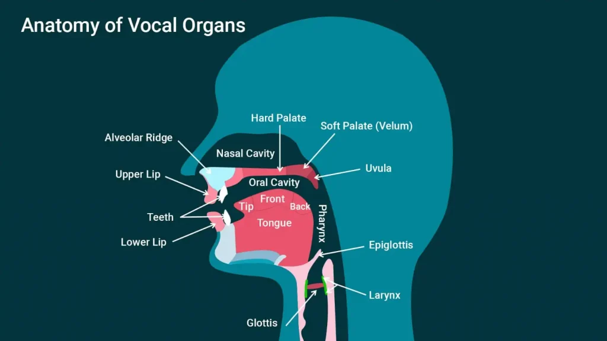
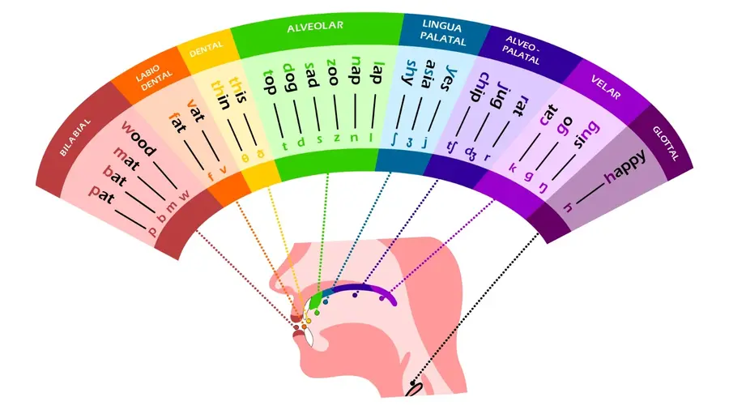

# Fonética e Fonologia

-   A produção de sons é realizada pelo `aparelho fonador`.
-   O aparelho fonador é composto de:
    -   Trato vocal: Onde o ar é transformado em som.
        -   Sistema Articulatório: Onde os articuladores se movem para definir as propriedades dos sons. Composto pelo nariz, lábios, dentes, língua, faringe e laringe.
            -   É constituído das cavidades nasal, oral e faringal.
        -   Sistema Fonatório: Onde os sons são produzidos. Composto somente pela laringe, que envolve a glote e as cordas vocais.
    -   Sistema Respiratório: Onde o ar trafega antes de ser expelido para a produção de som. Compost por traqueia, pulmões, brônquios e diafragma.
-   No topo da cavidade oral existem três partes relevantes na produção de consoantes:
    -   Alvéolos ou crista alveolar (Alveolar ridge): são as cavidades responsáveis por segurar os dentes, ou seja, a parte teciduosa logo acima destes.
    -   Palato duro (Hard palate): Parte óssea do céu da boca.
    -   Palato mole ou véu palatino (Soft palate/Velum): Parte não-óssea do céu da boca, próxima à úvula e garganta.

## Vogais

**Vogais se referem aos sons produzidos sem obstruções no trato vocal, ou seja, com a língua em repouso e sendo definidas principalmente pelo posicionament da boca/lábios.**

### Posicionamento vertical/Altura

-   `Fechada (Close)`: A língua quase toca ou toca o céu da boca.
-   `Média (Mid)`: A língua fica entre o céu da boca e sua posição de repouso.
-   `Aberta (Open)`: A língua fica na posição de repouso (chão da boca) ou bem próxima.

### Posicionamento horizontal/Avanço

-   `Anterior/Avançada (Front)`: A língua fica um pouco à frente da posição central, tendendo aos dentes.
-   `Central`: A língua fica um pouco distante da garganta e ainda mais dos dentes.
-   `Posterior/Recuada (Back)`: A língua fica próxima à garganta.

### Arredondamento

-   `Arredondada (Rounded)`: A boca forma uma abertura circular.
-   `Não arredondada (Unrounded)`: A boca não forma uma abertura circular.

> [!IMPORTANT]
> Uma `Semivogal` ou `glide` é, na verdade, uma consoante com som parecido ao de uma vogal. Porém estes sons não ocorrem sozinhos em uma sílaba, sendo utilizados comumente em ditongos. Ex.: No inglês, o "w" em "wet" e o "y" em "yet" são consideradas semivogais.

## Consoantes

**Consoantes se referem aos sons produzidos ao causar uma obstrução, chamada constrição ou oclusão, no trato vocal, de forma com que o ar passe de forma diferente do normal.**

-   Constrições são realizadas por um articulador ativo (órgão capaz de se movimentar, como a língua) e um articulador passivo (órgão estático, como o céu da boca).
-   Articuladores passivos: lábio superior, dentes superiores, alvéolos, palato duro, palato mole (ou véu palatino), úvula.
-   Articuladores ativos: lábio inferior, língua, véu palatino, pregas vocais.
    -   O véu palatino pode ser articulador ativo na articulação de consoantes nasais e articulador passivo na articulação de consoantes velares.
-   A língua é ser dividida em: ponta, lâmina (topo, logo antes da ponta), parte anterior (antes da lâmina), parte central, parte posterior (próximo à garganta).

### Pontos de Articulação

**Um ponto de articulação se refere ao local aproximado onde a constrição é realizada.**

-   Bilabial: o lábio inferior se move em direção ao lábio superior.
-   Labiodental: o lábio inferior se move em direção aos dentes superiores.
-   Dental: a ponta/lâmina da língua se move em direção aos dentes superiores.
-   Alveolar: a ponta/lâmina da língua se move em direção aos alvéolos.
-   Pós-alveolar/Alveopalatal/Alvéolo-palatai/Pré-palatal (Postalveolar): a parte anterior da língua se move na direção entre os alvéolos e o palato duro.
-   Retroflexo: similar ao pós-alveolar, mas com a ponta da língua curvada para trás.
-   Palatal: a parte central da língua se move em direção ao palato duro.
-   Velar: a parte posterior da língua se move na direção ao véu palatino.
-   Glotal: as cordas vocais se movem entre si, funcionando como articuladores ativos e passivos.

<table>
    <tr>
        <td rowspan="3"></td>
        <td>1: Exo-labial</td>
        <td>2: Endo-labial</td>
        <td>3: Dental</td>
        <td>4: Alveolar</td>
        <td>5: Pós-alveolar</td>
        <td>6: Pré-palatal</td>
    </tr>
    <tr>
        <td>7: Palatal</td>
        <td>8: Velar</td>
        <td>9: Uvular</td>
        <td>10: Faringeal</td>
        <td>11: Glotal</td>
        <td>12: Epiglotal</td>
    </tr>
    <tr>
        <td>13: Radical</td>
        <td>14: Postero-dorsal</td>
        <td>15: Antero-dorsal</td>
        <td>16: Laminal</td>
        <td>17: Apical</td>
        <td>18: Sub-apical</td>
    </tr>
</table>

### Modos de Articulação

**É como os articuladores interagem durante a formação do som.**

-   Oclusiva (Oclusive): ocorre a completa oclusão da passagem da corrente de ar, tanto oral quanto nasal.
    -   Também chamada "plosiva" (plosive).
    -   Em consoantes sonoras, a vibração é o único som produzido. Em surdas, nenhum som é produzido até que o ar seja expelido "explodindo" para a pronúncia de uma vogal.
-   Nasal (Nasal): também é oclusiva, mas envolve a passagem de ar pelo nariz. O ar tem acesso à cavidade nasal sendo expelido pelas narinas e também pela boca após a soltura da oclusão.
-   Fricativa (Fricative): ocorre fricção durante a produção das consoantes. A língua fica muito próxima ao outro articulador, mas não o toca. O fluxo de ar é turbulento.
    -   Sibilante (Sibilant): dirige-se o ar através da língua em direção aos dentes superiores, criando um som agudo .
-   Africada (Affricate): ocorre inicialmente oclusão total da passagem da corrente de ar e em seguida ocorre fricção.
    -   Geralmente são representadas por dois símbolos juntos: um para a parte oclusiva e outro para a parte fricativa.
-   Aproximante (Approximant): há pouca oclusão entre os articuladores, ainda menos que nas fricativas (de forma com que não sejam turbulentas), mas ainda mais que em uma posição neutra.
    -   Lateral: a passagem de ar ocorre em uma ou ambas as laterais da boca, com a oclusão ocorrendo no centro.
-   Róticas (Rhotic): ocorrem uma ou mais breves oclusões. Conhecidas assim pois se referem aos sons de "r".
    -   Tepe (Tap/Flap): ocorre uma única e rápida oclusão da passagem da corrente de ar.
    -   Vibrante (Trill): ocorrem várias oclusões e aberturas da passagem da corrente de ar.

> [!NOTE]
> Laterais e róticas formam uma classe de consoantes chamada de "líquida", pelos sons entre "r" e "l".

### Fonação ou Vozeamento

**Se refere à vibração das cordas vocais.**

-   Sonora ou Vozeada: o som é produzido vibrando as cordas vocais.
-   Surda ou Não-vozeada: o som é produzido sem vibrar as cordas vocais.
    -   Na nomenclatura das consoantes, se não for explicitado que uma consoante é surda, então ela é sonora.

<table>
    <thead>
        <tr>
            <th colspan="2">Pares comuns</th>
        </tr>
        <tr>
            <th>Surda</th>
            <th>Sonora</th>
        </tr>
    </thead>
    <tr>
        <td>p</td>
        <td>b</td>
    </tr>
    <tr>
        <td>t</td>
        <td>d</td>
    </tr>
    <tr>
        <td>k</td>
        <td>ɡ</td>
    </tr>
    <tr>
        <td>f</td>
        <td>v</td>
    </tr>
    <tr>
        <td>θ</td>
        <td>ð</td>
    </tr>
    <tr>
        <td>s</td>
        <td>z</td>
    </tr>
    <tr>
        <td>ʃ</td>
        <td>ʒ</td>
    </tr>
    <tr>
        <td>tʃ</td>
        <td>dʒ</td>
    </tr>
</table>
