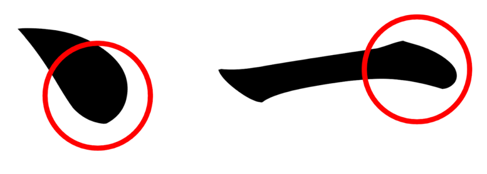
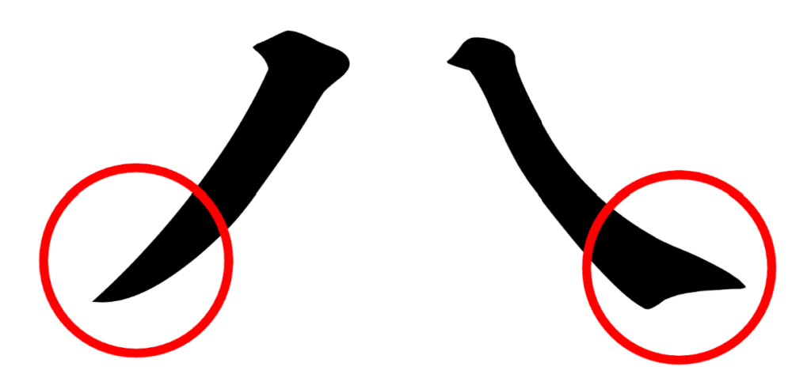
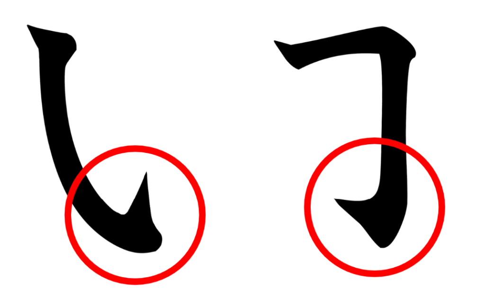
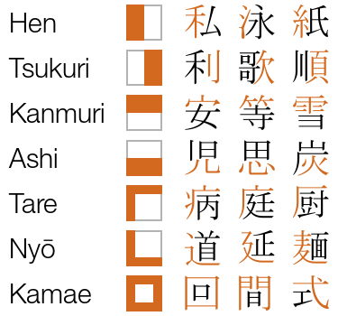

# <ruby>漢<rt>かん</rt>字<rt>じ</rt></ruby> - Kanji (Caracteres chineses)

## <ruby>筆<rt>ひっ</rt>画<rt>かく</rt></ruby> - Traços

-   Um único traço é chamado <code><ruby>点<rt>てん</rt>画<rt>かく</rt></ruby></code>.
-   Um traço pode ser desenhado de três formas:
    -   <code><ruby>留<rt>と</rt></ruby>め</code>: Com uma linha de fim abrupto, ou seja, deixando o pincel parado no fim.
        -   <image src="../assets/images/ten.png" style="width:1.75rem; vertical-align: middle; margin-right: 0.5rem;background-color: #E8F9FD; border-radius: 10px; border: 5px #960018 solid;"></image><code><ruby>点<rt>てん</rt></ruby></code>: Traço ponto
        -   <image src="../assets/images/yoko.png" style="width:1.75rem; vertical-align: middle; margin-right: 0.5rem;background-color: #E8F9FD; border-radius: 10px; border: 5px #960018 solid;"></image><code><ruby>横<rt>よこ</rt></ruby></code>: Traço horizontal
    -   <code><ruby>払<rt>はら</rt></ruby>い</code>: Com uma pincelada.
        -   <image src="../assets/images/tate.png" style="width:1.75rem; vertical-align: middle; margin-right: 0.5rem;background-color: #E8F9FD; border-radius: 10px; border: 5px #960018 solid;"></image><code><ruby>竪<rt>たて</rt></ruby></code>: Traço vertical
        -   <image src="../assets/images/hane-stroke.png" style="width:1.75rem; vertical-align: middle; margin-right: 0.5rem;background-color: #E8F9FD; border-radius: 10px; border: 5px #960018 solid;"></image><code><ruby>跳<rt>は</rt></ruby>ね</code>: Traço ascendente
        -   <image src="../assets/images/hidari-harai.png" style="width:1.75rem; vertical-align: middle; margin-right: 0.5rem;background-color: #E8F9FD; border-radius: 10px; border: 5px #960018 solid;"></image><code><ruby>左<rt>ひだり</rt>払<rt>はら</rt>い</ruby></code>: Traço caindo para a esquerda
        -   <image src="../assets/images/migi-harai.png" style="width:1.75rem; vertical-align: middle; margin-right: 0.5rem;background-color: #E8F9FD; border-radius: 10px; border: 5px #960018 solid;"></image><code><ruby>右<rt>みぎ</rt>払<rt>はら</rt>い</ruby></code>: Traço caindo para a direita
        -   <image src="../assets/images/hidari-sori.png" style="width:1.75rem; vertical-align: middle; margin-right: 0.5rem;background-color: #E8F9FD; border-radius: 10px; border: 5px #960018 solid;"></image><code><ruby>左<rt>ひだり</rt>反<rt>そ</rt></ruby>り</code>: Traço arqueado para a esquerda
    -   <code><ruby>跳<rt>は</rt></ruby>ね</code>: Com um "pulo", um gancho no final da pincelada.
        -   <image src="../assets/images/kagi.png" style="width:1.75rem; vertical-align: middle; margin-right: 0.5rem;background-color: #E8F9FD; border-radius: 10px; border: 5px #960018 solid;"></image><code><ruby>鉤<rt>かぎ</rt></ruby>・<ruby>跳<rt>は</rt></ruby>ね</code>: Traço vertical com gancho
        -   <image src="../assets/images/ore.png" style="width:1.75rem; vertical-align: middle; margin-right: 0.5rem;background-color: #E8F9FD; border-radius: 10px; border: 5px #960018 solid;"></image><code><ruby>折<rt>お</rt></ruby>れ</code>: Traço horizontal dobrando para baixo com ângulo na direita
        -   <image src="../assets/images/migi-sori.png" style="width:1.75rem; vertical-align: middle; margin-right: 0.5rem;background-color: #E8F9FD; border-radius: 10px; border: 5px #960018 solid;"></image><code><ruby>右<rt>みぎ</rt>反<rt>そ</rt></ruby>り</code>: Traço arqueado para a direita

## Ordem dos traços

-   A ordem de traços é:
    -   Esqueda para direita, cima para baixo;
    -   Horizontal primeiro
    -   Em caixas, traço superior e direito são um só.
    -   Em caixas, o traço inferior deve ser o último, vindo depois do que está dentro da caixa.
    -   Se a caixa possui só a parte de baixo, ela deve vir por último.
    -   Se existe um traço vertical entre um diagonal, ele deve vir primeiro.
    -   Em traços diagonais, o da direita pra esquerda vem primeiro.
    -   Se um traço vertical atravessa vários horizontais, ele deve ser escrito após todos os horizontais.
    -   Se o traço é uma pequena "vírgula", ele deve ser o último, exceto se estiver no topo, onde deve ser o primeiro.

## Posicionamento dos radicais

-   <code><ruby>偏<rt>へん</rt></ruby></code>: Radical que fica na esquerda do kanji.
-   <code><ruby>旁<rt>つくり</rt></ruby></code>: Radical que fica na direita do kanji.
-   <code><ruby>冠<rt>かんむり</rt></ruby></code>: Radical que fica no topo do kanji.
-   <code><ruby>脚<rt>あし</rt></ruby></code>: Radical que fica na parte de baixo do kanji.
-   <code><ruby>垂<rt>たれ</rt></ruby></code>: Radical que fica no topo e na esquerda do kanji.
-   <code><ruby>繞<rt>にょう</rt></ruby></code>: Radical que fica na parte de baixo e na esquerda do kanji.
-   <code><ruby>構<rt>かまえ</rt></ruby></code>: Radical que envolve o kanji.

-   Palavras com dois ou mais kanji são chamadas <code><ruby>熟<rt>じゅく</rt>語<rt>ご</rt></ruby></code>.

> [!TIP]
> Em algumas palavras, determinados kanji são utilizados apenas para manter a fonética da palavra, de forma com que o significado do kanji pode ser desconexo do significado da palavra. Nestas palavras, os kanji são chamados <code><ruby>当<rt>あ</rt></ruby>て<ruby>字<rt>じ</rt></ruby>・<ruby>宛<rt>あて</rt>字<rt>じ</rt></ruby></code>.

## <ruby>部<rt>ぶ</rt>首<rt>しゅ</rt></ruby> - Radicais

> [!NOTE]
> Existem cerca de 214 radicais.

-   <code><ruby>⽇<rt>ひ・にち</rt></ruby></code> Sol
    -   <code><ruby><rt>ひへん</rt></ruby></code> Posição Hen
-   <code><ruby>月<rt>つき</rt></ruby></code> Lua
    -   <code><ruby>⺝<rt>つきへん</rt></ruby></code> Posição Hen
-   <code><ruby>⾋<rt>くさ</rt></ruby></code> Grama
    -   <code><ruby>⺾<rt>くさかんむり</rt></ruby></code> Posição Kanmuri
-   <code><ruby>⽔<rt>みず</rt></ruby></code> Água
    -   <code><ruby>⺡<rt>さんずい</rt></ruby></code> Posição Hen
-   <code><ruby>木<rt>き</rt></ruby></code> Árvore
    -   <code><ruby><rt>きへん</rt></ruby></code> Posição Hen
-   <code><ruby>⽕<rt>ひ</rt></ruby></code> Fogo
    -   <code><ruby><rt>ひへん</rt></ruby></code> Posição Hen
    -   <code><ruby>灬<rt>れっか</rt></ruby></code> Posição Ashi
-   <code><ruby>山<rt>やま</rt></ruby></code> Montanha
    -   <code><ruby><rt>やまへん</rt></ruby></code> Posição Hen
    -   <code><ruby><rt>やまかんむり</rt></ruby></code> Posição Kanmuri
-   <code><ruby>土<rt>つち</rt></ruby></code> Terra
    -   <code><ruby><rt>つちへん</rt></ruby></code> Posição Hen
-   <code><ruby>石<rt>いし</rt></ruby></code> Pedra
    -   <code><ruby><rt>いしへん</rt></ruby></code> Posição Hen
-   <code><ruby>人<rt>ひと</rt></ruby></code> Homem
    -   <code><ruby>亻<rt>にんべん</rt></ruby></code> Posição Hen
    -   <code><ruby>𠆢<rt>ひとやね</rt></ruby></code> Posição Kanmuri

## Nomes

-   `田` Ta/Da
-   `中` Naka
-   `山` Yama
-   `口` Guchi
